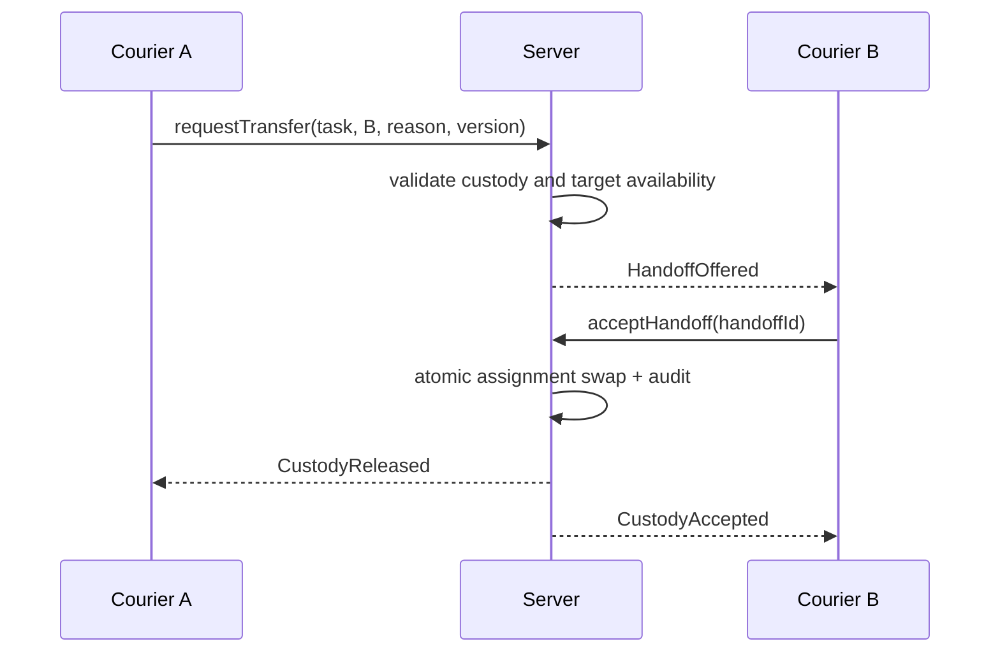
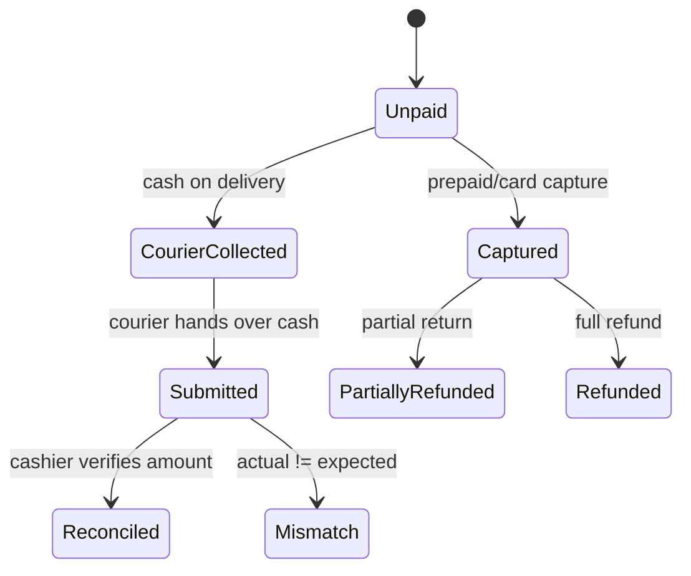

# MeaSoft business workflows and Mazetto lessons

## Order / correspondence aggregate

**MEASOFT FACT:** MeaSoft'ning asosiy operatsion obyekti correspondence/shipment bo'lib, uning kartasida sender, receiver, address, delivery interval, urgency, comments, finance, services, enclosures, package/place, dimensions/weight, files va issuance fields jamlanadi. Client order number va system identifier integrationda alohida ishlatiladi. Source: [Карточка корреспонденции](https://wiki.courierexe.ru/index.php/Карточка_корреспонденции), [API](https://wiki.courierexe.ru/index.php/API).

**OUR INTERPRETATION:** “Order” client intent/billing konteyneri, “shipment/correspondence” esa custody va delivery unit. Fast-food'da ko'pincha 1:1 bo'ladi, lekin supplemental order, split preparation yoki bir orderning bir nechta delivery task'i bu farqni muhim qiladi.

**OUR RECOMMENDATION:** Mavjud `Order` va `OrderItem`ni saqlab, delivery uchun alohida `DeliveryTask`; keyin zarur bo'lsa `Fulfillment` aggregate qo'shilsin. Order item snapshotlari o'zgarmas tarix uchun saqlansin; oshxonaga yuborilgandan keyingi qo'shimchalar yangi revision/supplemental ticket bilan berilsin.

### Editing, cancellation, cloning and search

| Concern | MeaSoft pattern | Mazetto recommendation |
| --- | --- | --- |
| Edit | Kartadagi maydonlar rol, status va biznes sozlamaga bog'liq | `PATCH` emas, maqsadli command; accepted/printed itemni in-place almashtirmaslik |
| Post-dispatch change | Courier app order o'zgarganini xabar qiladi | `OrderRevisionCreated` + yangi kitchen delta ticket + courier notification |
| Delete | Bog'liqlik bo'lsa status/disable/cancel ishlatiladi | Financial/custody history bo'lsa hard delete taqiqlansin |
| Clone | Mavjud ma'lumotdan yangi object yaratish operator vaqtini tejaydi | `duplicateOrder` yangi ID va idempotency key bilan; payment/history ko'chirilmasin |
| Search | Ko'p fieldli list, filter, color, context va mass action | Server-side filter/sort, saved views, selection-safe bulk actions |

## Action catalog

| Action | Preconditions | Actor | Input | Before -> After | Side effects / audit | Failure handling |
| --- | --- | --- | --- | --- | --- | --- |
| Issue to courier | Active courier/shift; order ready; no active assignment | Dispatcher/manager | courier, orders, manifest/barcodes | Ready -> Issued | custody event, route/list update | Transaction rollback on conflicting assignment |
| Courier accepts | Assignment belongs to courier and is offered | Courier | assignment version | Offered -> Accepted | accepted timestamp | Idempotent repeat; stale version conflict |
| Transfer courier | Current custody valid; target available | Dispatcher or allowed courier | from/to/reason | Assigned A -> Handoff -> Assigned B | two-party custody history | Remain with A until B accepts |
| Report delivered | Courier has custody; evidence requirements met | Courier | time, geo, PIN/photo, payment result | EnRoute -> ReportedDelivered | preliminary event, settlement task | Queue offline, dedupe by device event ID |
| Report partial | Item quantities valid and sum to ordered quantity | Courier | accepted/returned qty, reason | EnRoute -> ReportedPartial | recalc expected cash, return items | Manager must verify item return |
| Report failed | Configured reason and required metadata present | Courier | reason, note, geo/photo/new date | EnRoute -> ReportedFailed | retry/return decision task | Reason-specific validation |
| Accept courier work | Courier reports exist; docs/items/money presented | Manager/cashier | scanned orders, cash amount | Reported -> AcceptedFromCourier | custody moves to office; cash receipt | Mismatch remains open, no silent close |
| Finalize delivery | Evidence and item quantities verified | Manager | result, delivery time | Accepted -> FinalDelivered/FinalFailed | customer update, billing | Permission and optimistic-lock check |
| Reconcile cash | Open collection exists; shift open/closable | Cashier/manager/accountant | expected/actual, denomination, reason | Submitted -> Verified/Mismatch | immutable cash transaction | Mismatch creates task; cannot force “balanced” |
| Reschedule | Failure reason permits retry; new slot valid | Dispatcher/manager | new date/slot/reason | ReportedFailed -> Rescheduled | assignment canceled, customer notified | Capacity conflict leaves old state |
| Cancel order | Domain-specific cancellation policy passes | Cashier/admin | reason, refund choice | Active -> Cancelled | kitchen stop, refund/void, audit | Partial side effects use compensating actions |
| Create manifest | Orders compatible with route/branch | Dispatcher/warehouse | route, courier/transport, orders | Selected -> Manifested | docs/barcodes | Reject duplicates/conflicting custody |
| Manual reprint | Original print job exists; permission granted | Manager/support | job, reason, target printer | Printed/Failed -> new ReprintJob | explicit copy marker and audit | Never mutate original success record |

Sources: [Выдача корреспонденции курьерам](https://wiki.courierexe.ru/index.php/Выдача_корреспонденции_курьерам), [Мобильное приложение курьера для Android](https://wiki.courierexe.ru/index.php/Мобильное_приложение_курьера_для_Android), [Манифесты](https://wiki.courierexe.ru/index.php/Манифесты), [Статусная модель](https://wiki.courierexe.ru/index.php/Статусная_модель).

## Courier lifecycle and chain of custody

1. **MEASOFT FACT:** Employee/courier is registered and receives mobile credentials/token or QR registration.
2. Dispatcher plans or issues shipments; scan/barcode supports physical handoff.
3. Courier downloads/accepts work, sees today's/planned/closed lists and map/navigation.
4. Courier can self-assign where policy permits; this is not equivalent to silent ownership overwrite.
5. On route courier can indicate intent, call parties, wait, capture photo, search barcode and update result.
6. Full, partial and failed delivery have different inputs. Failure reason may demand new date or indicate whether courier visited the recipient.
7. Courier-to-courier transfer is an explicit action; target acceptance should complete custody change.
8. Result sent by mobile app is preliminary until office acceptance.
9. Courier hands manager documents, returned goods and money. Manager scans/verifies and may print a cash receipt/order.
10. Shift/route is closable only after unresolved custody and money are reconciled or explicitly escalated.

Source: [Мобильное приложение курьера для Android](https://wiki.courierexe.ru/index.php/Мобильное_приложение_курьера_для_Android), [Выдача корреспонденции курьерам](https://wiki.courierexe.ru/index.php/Выдача_корреспонденции_курьерам).

### Courier A to B transfer

**OUR RECOMMENDATION:** `CourierAssignment`ni overwrite qilmaslik; `CourierHandoff`da from/to, offered/accepted timestamps, actor, reason va state saqlash. B qabul qilmaguncha A mas'ul bo'lib qoladi.

## Failed delivery reason system

**MEASOFT FACT:** Non-delivery reasons directory sifatida boshqariladi va metadata business behaviorga ta'sir qiladi. Masalan, reason courier recipient manziliga borganini bildirishi mumkin; ayrim natijalar return yoki new delivery date oqimini ochadi. Source: [Выдача корреспонденции курьерам](https://wiki.courierexe.ru/index.php/Выдача_корреспонденции_курьерам), [Статусы](https://wiki.courierexe.ru/index.php/Статусы).

**OUR RECOMMENDATION:** `DeliveryFailureReason` fieldlari: `tenantId`, `code`, `label`, `active`, `faultParty`, `requiresNote`, `requiresPhoto`, `requiresGeo`, `requiresNewSlot`, `requiresReturn`, `retryAllowed`, `customerVisibleText`, `chargePolicy`. Erkin string faqat `note`; qarorlar reason code orqali qilinadi.

## Partial delivery

**MEASOFT FACT:** Courier accepted va returned enclosure/itemlarni belgilaydi. Manager scan bilan qaytgan SKU/quantityni tasdiqlaydi; tasdiqlanmagan returnlar qolsa forma yopilganda o'zgarish saqlanmaydi. Money view avtomatik yangilanadi. Source: [Выдача корреспонденции курьерам](https://wiki.courierexe.ru/index.php/Выдача_корреспонденции_курьерам), [Мобильное приложение курьера для Android](https://wiki.courierexe.ru/index.php/Мобильное_приложение_курьера_для_Android).

**OUR RECOMMENDATION:** Har `DeliveryAttemptItem` uchun `orderedQty`, `acceptedQty`, `returnedQty`, `damagedQty`, `reasonCode`; invariant `accepted + returned + damaged = handedOff`. Server subtotal, refund, expected courier cash va inventory compensationni transaction ichida hisoblaydi. Restaurant policy ruxsat bermasa fast-food orderda partial delivery o'chiriladi; lekin model emergency/refusal holati uchun tayyor bo'ladi.

## Payment and money flow

**MEASOFT FACT:** Delivery status, payment type, courierdagi cash, incoming money act, client debt va courier billing alohida hisoblanadi. Courier ishini qabul qilishda pul topshirishi, manager esa cash document chiqarishi mumkin. Source: [Акты передачи денег и корреспонденции](https://wiki.courierexe.ru/index.php/Акты_передачи_денег_и_корреспонденции), [Учет наличных по бухгалтерии](https://wiki.courierexe.ru/index.php/Учет_наличных_по_бухгалтерии), [Биллинг курьеров](https://wiki.courierexe.ru/index.php/Биллинг_курьеров).

**Direct answer:** `Delivered` va `Paid` bir narsa emas. Delivery physical outcome; payment authorization/capture/refund; cash collection pulning kuryerga o'tishi; settlement esa kuryerdan kompaniyaga topshirilishi.

`CashCollection` expected/actual currency amount, holder employee/shift, source order/payment, collected/submitted/verified timestamps and immutable transactionsni saqlaydi. Super admin “majburan topshirish” orqali tarixni soxtalashtirmaydi: talab yuboradi, shift closingni bloklaydi yoki manager verified override'ni reason bilan bajaradi.

## API and reliable synchronization

**MEASOFT FACT:** XML HTTP API create, status, changed-status retrieval, change, cancel, attachments, print documents, directories, warehouse movement, fiscal data, tariffs, branch/PVZ, acts and manifest operationsini beradi. Rate limits bor; docs polling uchun `changes=ONLY_LAST` va muvaffaqiyatli qabuldan keyin `commitlaststatus`ni majburiy tavsiya qiladi. Source: [API](https://wiki.courierexe.ru/index.php/API), revision 2026-06-11.

**OUR INTERPRETATION:** Bu at-least-once pull + acknowledgement protocol. Consumer crash bo'lsa commit bo'lmagan batch yana olinadi; consumer dedupe qilishi shart.

**OUR RECOMMENDATION:** Printer, notification va integration uchun:

1. DB outbox transaction bilan domain change yonida yoziladi.
2. Consumer batchni lease qiladi; har message stable `eventId`/`idempotencyKey`ga ega.
3. Side effect tugagach inbox/attempt yoziladi, keyin ACK qilinadi.
4. Timeout yoki lost ACK duplicate delivery keltirishi mumkin, shuning uchun consumer idempotent.
5. Exponential backoff, jitter, max attempts va dead letter operator view bo'ladi.
6. Cursor faqat butun batch durable saqlangach oldinga yuradi.

API contractlarda tenant credential, pagination/cursor, UTC timestamp, stable error code, retryability va request id majburiy bo'lsin. Create/change commandlar `Idempotency-Key`; conflicting replay `409` va oldingi result linkini qaytarsin.

## Reliable kitchen printing

**MEASOFT FACT:** Documentation local fiscal/check service, printer/driver setup, logging, fiscal errors, mobile/office printing va troubleshootingni alohida ko'radi. Source: [Настройка модуля печати кассовых чеков](https://wiki.courierexe.ru/index.php/Настройка_модуля_печати_кассовых_чеков), [Оборудование](https://wiki.courierexe.ru/index.php/Оборудование).

**OUR RECOMMENDATION:** Cloudflare Tunnel notebook printerga serverdan inbound ulanish uchun ishlatilmasin. Agent outbound HTTPS/WebSocket orqali jobs oladi.

| Failure | Required behavior |
| --- | --- |
| Duplicate delivery/lost ACK | Stable `PrintJob.idempotencyKey`; agent durable spool dedupe |
| Printer offline | `RETRY_WAIT`, backoff, visible alert; order yo'qolmaydi |
| Notebook/internet offline | Lease expires; another approved agent or same agent later claims |
| Server/agent restart | DB job and local spool recover; in-memory state source of truth emas |
| Timeout/unknown result | `UNKNOWN` attempt; avtomatik duplicate print emas, operator inspection |
| Manual reprint | New child job, reason, actor, “COPY” marker and audit |
| Printer change | Routing version snapshot jobda saqlanadi; reroute explicit |

`PENDING -> CLAIMED -> PRINTING -> PRINTED`; retryable failure `RETRY_WAIT -> PENDING`; exhausted `DEAD_LETTER`. Claim atomik lease token bilan; `ack(jobId, leaseToken, agentAttemptId, printerEvidence)` eski agent ACK'ini qabul qilmaydi.

## Automation, notification and exceptions

**MEASOFT FACT:** Automation module jobs, setup, import/export, interpreted rules, examples and troubleshootingni beradi; SMS, Webhook, tasks/tickets va replication alohida modullar. Sources: [Настройка модуля автоматизации](https://wiki.courierexe.ru/index.php/Настройка_модуля_автоматизации), [Webhook](https://wiki.courierexe.ru/index.php/Webhook), [Модуль отправки SMS-сообщений](https://wiki.courierexe.ru/index.php/Модуль_отправки_SMS-сообщений), [Тикеты](https://wiki.courierexe.ru/index.php/Тикеты), [Модуль репликации данных](https://wiki.courierexe.ru/index.php/Модуль_репликации_данных).

**OUR RECOMMENDATION:** Avval code-defined automationlar; tenant-editable generic scriptingni keyinga qoldirish. Minimal rule: `trigger event + typed conditions + allowlisted actions + version + enabled + retry policy`. “Sent” transportga uzatildi degani emas; provider acceptance va yakuniy delivery attempt alohida.

P0 rules:

- `OrderAccepted` -> kitchen ticket + print job + outbox event.
- `KitchenReady` -> cashier/dispatcher notification.
- `DeliveryReported` -> customer notification + manager finalization task + settlement expectation.
- `PrintDeadLetter`, `PaymentMismatch`, `OrderStuck`, `CourierCashOverdue` -> operational task/ticket.

## Warehouse, manifest and reports

**MEASOFT FACT:** Warehouse module receipt, write-off, transfer, assembly/disassembly, reservation, serials, inventory, packaging and reportsni qamraydi. Manifest esa planning, customs, assembly, departure, transit places, documents, receipt va profitabilityga ega. Sources: [Модуль складского учета](https://wiki.courierexe.ru/index.php/Модуль_складского_учета), [Манифесты](https://wiki.courierexe.ru/index.php/Манифесты).

Fast-food uchun hozir kerak: ingredient stock movement, reservation policy, waste/damage, branch transfer, count/reconciliation va immutable inventory event. Hozir kerak emas: customs, international linehaul, serial-number logistics va complex transit places.

KPI catalog: order count/value; acceptance, preparation, ready-waiting, assignment, pickup-to-delivery and total fulfillment time; cancel/failure/redelivery/refund/payment-failure rates; courier cash debt/age; print failure/retry/duplicate rate; branch, kitchen, cashier and courier performance. Source pattern: [Отчеты](https://wiki.courierexe.ru/index.php/Отчеты), [Пользовательские отчеты](https://wiki.courierexe.ru/index.php/Пользовательские_отчеты).

## Roles and UX

| Role | Allowed critical actions | Explicitly disallowed |
| --- | --- | --- |
| Owner | tenant config, role policy, financial override with reason | erase audit/settled transactions |
| Admin | branch config, employees, operational corrections | owner transfer without owner flow |
| Branch manager | final delivery, assignment, exception resolution | cross-tenant access |
| Cashier | create/accept order, payment, shift, cash receipt | kitchen completion without kitchen role |
| Kitchen | accept/prepare/ready/pack ticket | refund, courier settlement |
| Dispatcher | assign/transfer/reschedule delivery | reconcile money |
| Courier | accept task, report delivery/failure, submit cash | final delivery confirmation |
| Accountant | verify settlement/refund/report | kitchen/delivery mutation |
| Support | inspect, retry approved technical jobs | financial override by default |
| System | deterministic automation commands | arbitrary role bypass |
| Print agent | claim/ack own routed print jobs | read unrelated tenant/order data |

**MEASOFT FACT:** Listlar context actions, status colors, scans, filters, warnings, bulk selection va permission-driven visibilitydan foydalanadi. **OUR RECOMMENDATION:** Mazetto admini Cloudflare uslubidagi grouped sidebarni saqlasin, lekin domain detail pages breadcrumb/back bilan chuqurlashsin. Destructive va financial actions confirmation + reason talab qilsin; mobil panellar dense list, sticky action va no-horizontal-scroll qoidalariga amal qilsin.

## Custom fields

**MEASOFT FACT:** User-defined fields tenant/clientga maxsus ma'lumot qo'shish imkonini beradi. Source: [Пользовательские поля](https://wiki.courierexe.ru/index.php/Пользовательские_поля).

**OUR RECOMMENDATION:** Label, optional metadata va integration pass-through uchun foydali. Payment, permission, status transition, tax yoki inventory invariantini custom JSON ichiga yashirmaslik kerak; bular typed columns/tables bo'ladi.
