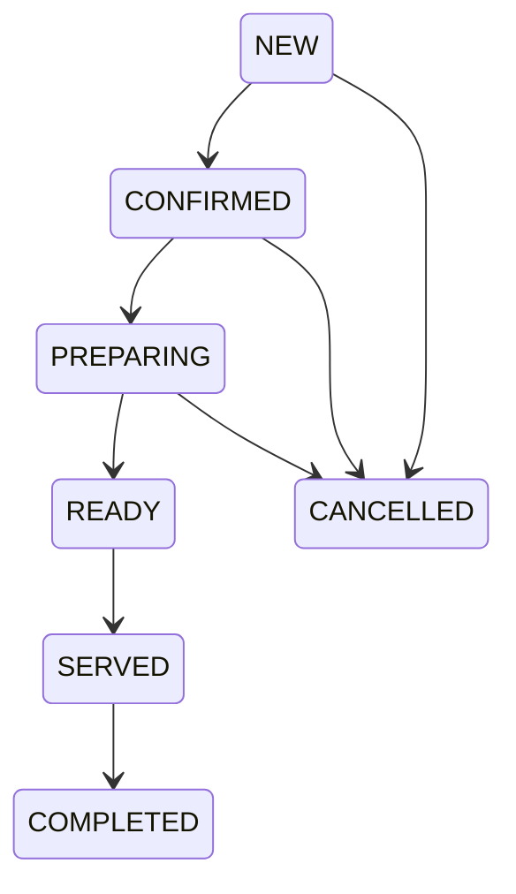

# MAZETTO FOOD Current Project Analysis

## Analysis baseline

- Source-of-truth commit: `d2bba66b8958097f3beaee848cdaa77717cb24b6` (`origin/main`, production tag at analysis start).
- Runtime shape: pnpm/Turborepo monorepo with five applications under `apps/`.
- This document describes observed repository behavior. It does not infer production data beyond the verified migration and smoke checks recorded during the release.

## Stack and deploy topology

| Concern | Current implementation | Evidence |
| --- | --- | --- |
| Staff/admin frontend | Next.js 16.3.2, React 19, TypeScript, Tailwind/PostCSS, Socket.IO client | `apps/pos-web/package.json`; routes under `apps/pos-web/app/` |
| Customer frontend | Next.js 16.3.2, React 19, Leaflet, Socket.IO client | `apps/customer-web/package.json`; `apps/customer-web/app/` |
| Backend | NestJS 11, HTTP REST, Socket.IO gateway, Swagger only outside production | `apps/backend/package.json`; `apps/backend/src/main.ts`; `KitchenGateway` |
| Database | PostgreSQL | `apps/backend/prisma/schema.prisma` datasource; `PrismaService` |
| ORM/migrations | Prisma 7.2, 27 production migrations at baseline | `apps/backend/prisma/`; release verification on 2026-09-14 |
| Cache/rate limits | Redis through ioredis, with in-memory fallback for selected cache/throttle paths | `RedisService`, `RedisCacheService`, `RedisThrottlerStorage` |
| Local printing | Outbound-polling Node/TypeScript Print Agent | `apps/print-agent/src/main.ts` |
| Telegram | Separate Node/TypeScript bot plus backend webhook/notification services | `apps/telegram-bot/src/main.ts`; `TelegramController`; `TelegramOrderNotificationService` |
| Deployment | Docker/Dokploy behind Cloudflare; separate backend, POS, customer, media, Telegram, PostgreSQL and Redis services | `docs/DOKPLOY_DEPLOYMENT.md`; `.github/workflows/deploy.yml` |

The public HTTP API is prefixed with `/api/v1`. `main.ts` enables request validation with unknown-field rejection, Helmet, credentialed CORS from `resolveAllowedOrigins`, a common response envelope and an HTTP exception filter.

## Authentication and authorization

### Staff authentication

`AuthController` exposes login, refresh, logout and `me`. `AuthService` issues JWT access/refresh tokens and stores refresh sessions in `Session`. `JwtAuthGuard` is a global guard and reloads the active user, active roles, role scope and permissions from the database through `UserAuthCacheService`; access tokens are not accepted as the sole authority. Inactive users are rejected.

Global guard order in `AppModule` is:

1. `MazettoThrottlerGuard`
2. `JwtAuthGuard`
3. `RolesGuard`
4. `PermissionsGuard`

`Role`, `Permission`, `RolePermission` and `UserRole` provide database-backed RBAC. `Role.isBranchScoped` distinguishes global from branch-bound roles. `AuthenticatedUser` carries `roles`, `permissions`, optional `employeeId`, optional `branchId`, and `isGlobalScope`. `resolveBranchScope` / `resolveRequiredBranchScope` enforce branch selection.

### Customer authentication

Customers are separate from staff users. `Customer`, `CustomerSession` and `CustomerVerificationChallenge` back phone-code authentication. `CustomersController` exposes request-code, verify-code, refresh, logout and profile routes. Customer JWTs use a separate secret and token-use marker. `CustomerAuthGuard` / `CurrentCustomer` protect customer routes.

### Current authorization strengths and gaps

- Strength: action endpoints generally combine role/permission guards with branch checks in services.
- Strength: WebSocket connections are authenticated and joined to `branch:{id}`, `staff:global`, or `customer:{id}` rooms by `KitchenGateway`.
- Gap: there is no `Tenant` or `Restaurant` entity. `Branch` is the highest business partition, so the schema cannot yet enforce SaaS tenant isolation.
- Gap: several role meanings remain encoded as string role codes in query logic, for example courier discovery in `CustomerCourierService.listCouriers`.

## Business hierarchy

Current hierarchy is effectively:

```text
Platform
└── Branch
    ├── Working hours
    ├── Employees / user roles
    ├── Halls / tables
    ├── Devices / printers
    ├── Menu availability
    ├── Orders / customer orders
    ├── Shifts / cash movements
    └── Warehouses / stock movements
```

`Branch` owns operational records by `branchId`. Categories, products, suppliers and payment methods may be global (`branchId = null`) or branch-specific. There is no first-class tenant, restaurant/legal entity, organization membership, tenant-scoped uniqueness, or tenant-aware query guard.

## Order model

### Core aggregate

`Order` in `apps/backend/prisma/schema.prisma` stores:

- identity: internal CUID, unique `orderNumber`, display date/sequence/number;
- scope: `branchId`, optional shift/table/waiter;
- channel/type: `OrderSource` (`WEB`, `TELEGRAM`, `POS`) and `OrderType` (`DINE_IN`, `TAKEAWAY`, `DELIVERY`);
- lifecycle: one `OrderStatus` (`NEW`, `CONFIRMED`, `PREPARING`, `READY`, `SERVED`, `COMPLETED`, `CANCELLED`);
- financial summary: `paymentStatus`, subtotal, discount, service, delivery and total;
- customer/delivery snapshots: name, phone, address, location;
- actors/timestamps: creator, accepter, server/assignee, closer, canceller;
- supplemental marker: `isSupplemental` for an additional waiter order after the original was sent to kitchen.

`CustomerOrder` links a customer checkout to its operational `Order` and stores customer order type, payment method, delivery address/location and notes. This two-record design isolates customer identity/history from the restaurant order but does not create a separate delivery task.

### Order items and snapshots

`OrderItem` retains `productName`, `variantName`, `unitPrice`, `totalPrice`, quantity and `modifierSnapshot`. Product and variant foreign keys are nullable with `SetNull`, so historic display survives catalog deletion. Cancellation is item-level soft state (`ACTIVE`/`CANCELLED`) with actor, reason and timestamp.

Strength: transaction-time names, prices and modifier selections are already snapshotted.

Gap: discount/tax/service allocation is not item-snapshotted, and ordered/delivered/returned quantities are not separated. Partial delivery and item-level refund accounting therefore have no explicit model.

### Creation paths

There are three principal creation paths:

- `OrdersService.createOrder`: staff/waiter draft-like POS order, starts `NEW` and writes `OrderStatusHistory`.
- `OrdersService.createPosCheckout`: full POS checkout in a serializable transaction; creates order/items, payment operation, payments, revenue/cash records, receipt, confirmation and kitchen ticket. It uses `PaymentOperation.idempotencyKey` plus request hash.
- `CustomerOrderEngineService.createOrder`: customer checkout, with `CustomerOrderAttempt` idempotency and stale-attempt recovery.

Display numbers are allocated by `allocateDisplayOrderNumber`. Unique constraints and bounded retry handle number races.

### Editing and supplemental orders

`OrdersController` provides item add/update and generic order status mutation. `OrdersService.addItem` and `updateItem` use `assertOrderCanChange`. Confirmed table orders do not mutate an already-sent kitchen ticket: `TablesService.createOrderForTable` can open a separate draft supplemental order marked `isSupplemental`, which is later confirmed and receives its own kitchen ticket.

This solves kitchen visibility for post-send additions, but supplemental orders remain separate financial/order aggregates rather than a revision or child shipment model.

### Status mutation

Two styles coexist:

- contextual actions: kitchen routes such as `PATCH /kitchen/orders/:id/start`, courier assignment, transfer acceptance, shift close;
- generic mutation: `PATCH /orders/:id/status`, `PATCH /orders/bulk/status`, and `PATCH /courier/orders/:id/status`.

`OrdersService.updateStatus` locks the order row, checks terminal states, records history and synchronizes kitchen tickets. It still accepts a requested status and contains broad transition rules rather than one complete action/state matrix. `bulkUpdateStatus` loops through the same generic method and returns partial success.

## State domains

### Order state

`Order.status` currently represents several meanings at once:



The actual allowed graph varies by order type and actor. For example, kitchen completion maps TAKEAWAY to `SERVED` but leaves DELIVERY at `READY`; courier then uses `SERVED` for an in-transit delivery and `COMPLETED` for delivered. Consequently `SERVED` means both dine-in served, takeaway handed over, and delivery in transit depending on context.

### Kitchen state

`KitchenTicket` has a separate `KitchenTicketStatus`: `NEW`, `ACCEPTED`, `COOKING`, `READY`, `COMPLETED`, `CANCELLED`. `KitchenService.applyOrderAction` locks the order, resolves contextual actions, updates both order and ticket atomically, writes order history and emits realtime events.

However, `kitchen-status-sync.ts` derives ticket state from `OrderStatus`. The ticket is not fully independent: generic order updates can force its state. It has no ticket items/stations, packed timestamp, handoff actor, optimistic version, or print state.

### Delivery state

There is no `DeliveryTask`, `DeliveryAttempt`, `CourierAssignment` or `CourierHandoff`. `CustomerCourierService` stores current courier ownership in `Order.servedById` and uses order states:

- `READY`: available/prepared;
- `SERVED`: courier has taken / is carrying it;
- `COMPLETED`: courier reports completion and may collect remaining cash;
- `CANCELLED`: courier cancellation.

`assignCourier` and courier self-claim both row-lock the order, preventing one common assignment race. Assignment history, accept/reject, two-party transfer, arrived, failed reason, reschedule, return, reported-vs-final and chain-of-custody are absent.

### Payment state

Payment is partly separated:

- `Order.paymentStatus` is an aggregate cache;
- each `Payment` has `PaymentStatus` and amount/method/provider reference;
- `PaymentOperation` provides idempotency and groups multiple tenders;
- `RevenueRecord`, `CashTransaction`, `CashTransfer` and `Shift` track operational cash.

`PaymentsService.processOrderPayment` validates branch/shift ownership, idempotency request hashes and tender totals in a transaction. Successful payment can create receipt/revenue/cash effects. Courier delivery completion can collect outstanding cash into the courier's open shift.

Gap: payment transaction type is implicit in `Payment`/references; there is no explicit authorize/capture/refund/void transaction ledger or `Refund` entity. Delivery completion and cash collection happen in the same courier action, and there is no separate courier settlement/reconciliation aggregate.

## Cash and shift workflow

`Shift` supports cashier/courier modes and totals. `CashTransaction` is the append-style money movement record. `CashTransfer` implements pending/accepted/rejected/disputed handover between shifts. `CashRegisterController` exposes open/close shift, create transfer, list receivers/pending transfers, and accept/reject. `ShiftsService.forceHandover` gives administrators a controlled forced handover action and writes audit.

This is a solid base for reconciliation, but delivery result, collected cash and finalized business outcome are not yet independent state transitions.

## Printing

### Server side

`Printer` stores branch, type, status and metadata. `Receipt` stores rendered content and only a Boolean `printed` plus `printedAt`. `ReceiptsController` lists unprinted receipts and marks one printed. Product-to-printer routing exists through `Product.printerId` and `ProductPrinterRouting`.

### Local agent

`apps/print-agent/src/main.ts` is outbound-only:

1. poll `/receipts?printed=false`;
2. fetch receipt detail;
3. send commands to file or TCP printer with bounded local retry;
4. call `PATCH /receipts/:id/print` after the print call succeeds.

This avoids inbound access to the restaurant notebook and therefore fits Cloudflare/Dokploy networking.

Reliability gaps:

- no persistent `PrintJob` or `PrintAttempt`;
- no atomic claim/lease, so two agents can print the same receipt;
- no separate claimed/printing/printed states;
- ACK loss after physical print can cause a duplicate;
- no stable payload hash or local completed-job cache;
- manual reprint is not a new auditable job;
- no dead-letter or printer-route history.

## Realtime and background processing

### Realtime

`KitchenGateway` authenticates staff/customer Socket.IO connections and emits only scoped lightweight events: `order.created`, `order.confirmed`, `order.sent_to_kitchen`, and `order.status_changed`. POS waiter and customer order pages subscribe and then refresh from REST. This correctly treats the database/REST response as source of truth rather than the socket payload.

The gateway currently performs a database lookup to resolve event scope and does not use a durable event broker. Events can be lost during disconnect; clients recover by refetching.

### Scheduled jobs

`MaintenanceScheduler` uses Nest Schedule:

- daily session cleanup;
- hourly expired verification/Telegram checkout cleanup;
- every ten minutes stale customer order-attempt cleanup.

There is no durable general job queue, outbox worker, stuck-order monitor, delivery SLA monitor or persistent automation engine.

### Notifications

Telegram notifications serialize work per order in process memory and retry transient Telegram requests. `NotificationDeadLetterService` records final Telegram failure in a bounded Redis list, with in-memory fallback, and admin retry is exposed by `NotificationsController`.

This provides operational visibility but not durable at-least-once delivery: Redis list/in-memory fallback is not a relational outbox, process restart can lose queued work, and only Telegram is covered.

## Audit and history

- `OrderStatusHistory` records from/to order status, staff/user actor, reason and time.
- `AuditLog` records administrative action, entity, entity ID, metadata, IP and user agent.
- financial records (`Payment`, `PaymentOperation`, `RevenueRecord`, `CashTransaction`, `CashTransfer`) provide specialized history.
- stock movement uses source identifiers and a uniqueness constraint to prevent duplicate recipe deductions.

Gaps against an immutable domain event log:

- no universal `OrderEvent` with event type, source, payload, reason code, correlation/causation IDs and idempotency key;
- item edits, assignment changes, printing, delivery attempts and many side effects are not one correlated timeline;
- database schema does not make audit rows append-only at the database permission/trigger level;
- lifecycle-aware retention is undocumented.

## Inventory and warehouse

`Warehouse`, `Stock`, `Ingredient`, `Recipe`, `RecipeItem` and `StockMovement` implement branch warehouse inventory. Confirming an order calls `OrdersService.deductRecipeStock`, which writes idempotent recipe deductions using source identifiers. Suppliers and manual movements are exposed through admin APIs.

Current limits include no reservation phase, no return/damage workflow tied to delivery attempts, and no item handoff/package/barcode entity.

## Panels and UX surfaces

`apps/pos-web` contains dedicated responsive routes for POS, waiter, kitchen, courier, shifts, accounting, manager and a broad admin shell. Admin routes include orders/detail, online orders, branches/halls/tables/devices, catalog/products/categories/modifiers/recipes, staff/roles/shifts, customers/couriers, inventory/suppliers/expenses/payments/receipts/reports, audit/settings/system health.

The kitchen UI presents contextual buttons and the courier UI presents operational actions. Admin order detail has order data and history, but not a unified subsystem timeline with independent Order/Kitchen/Delivery/Payment/Print states or server-computed `allowedActions`.

## API surface summary

Important route groups observed in controller decorators:

| Domain | Routes |
| --- | --- |
| Orders | `POST/GET /orders`, `GET /orders/:id`, item add/update, generic/bulk status |
| POS | `GET /pos/catalog`, `POST /pos/orders` |
| Kitchen | queue/history and accept/start/ready/complete/cancel actions |
| Customer | auth, menu, branches, quote, create/cancel/history/detail |
| Courier | queue/history, courier list/deliveries, assign, generic status |
| Payments | list, create and process |
| Cash | shifts, transactions, transfers, accept/reject, forced handover |
| Printing | printers CRUD subset, receipts list/detail/mark printed |
| Admin | branches, tables/halls, staff/roles, devices, settings, audit, reports, inventory, suppliers, homepage |

The API uses action endpoints in several domains but has no single business-action contract, `allowedActions`, explicit idempotency header middleware, optimistic version field, or standard domain error envelope carrying current state/action.

## Architecture assessment before MeaSoft comparison

### Preserve

1. Transactional POS and customer checkout idempotency.
2. Order item snapshots and nullable catalog references.
3. Row locks around status/assignment/cash-critical paths.
4. Separate kitchen ticket and payment/cash records.
5. Branch-scoped RBAC and authenticated realtime rooms.
6. Append-style status, stock and financial histories.
7. Outbound local print agent networking.

### Highest-risk gaps

1. One overloaded `OrderStatus` still coordinates order, kitchen, service and delivery.
2. Courier result is immediately final; reported/finalized and failed-attempt models are absent.
3. Current assignment overwrites `servedById`; custody history is lost.
4. Printing has no durable job/claim/lease/attempt/idempotent ACK model.
5. There is no transactional outbox or durable event catalog.
6. No immutable correlated order event timeline.
7. No tenant/restaurant boundary above branch.
8. Refund and payment transaction lifecycles are incomplete.
9. Generic status endpoints can bypass a fully explicit action matrix.
10. Operational exceptions and stuck-order detection are not first-class.

These findings are the comparison baseline. MeaSoft facts and recommendations must be labelled separately in later documents.
