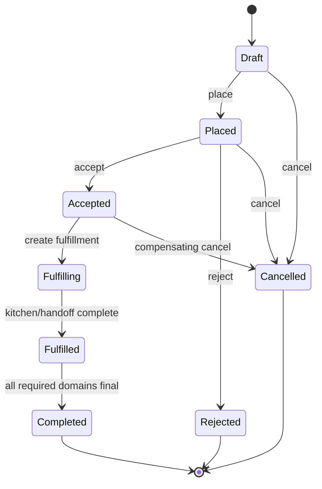
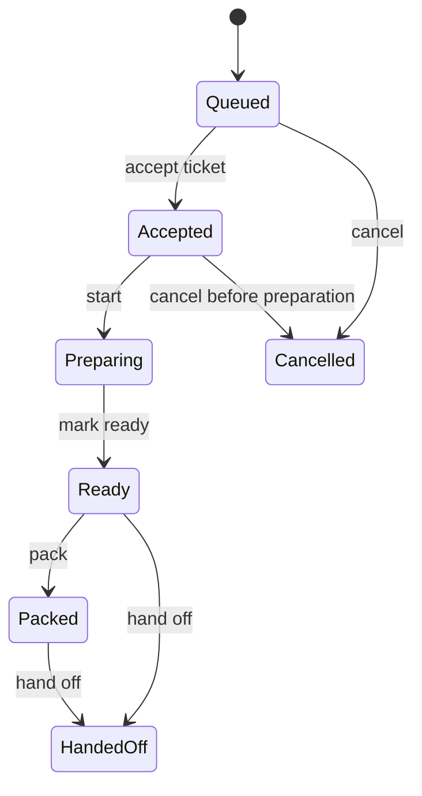
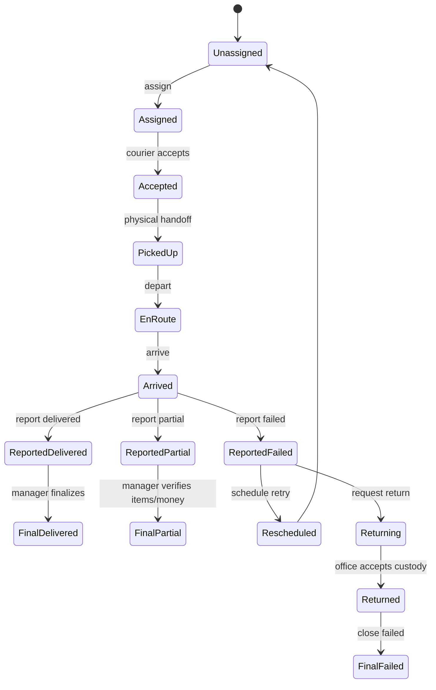
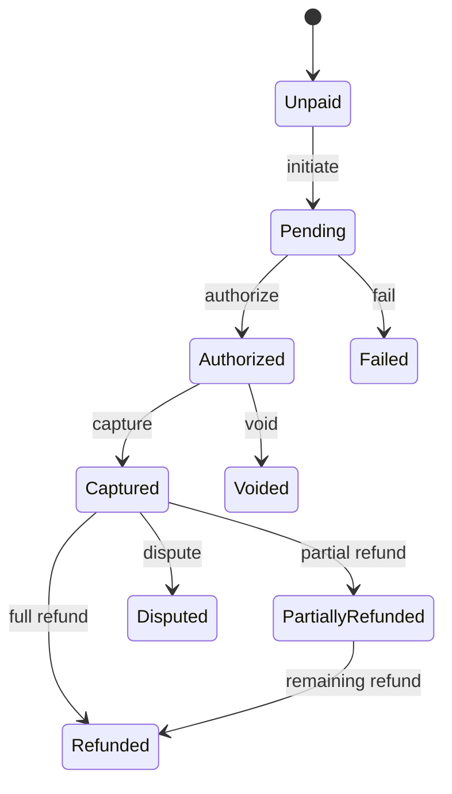
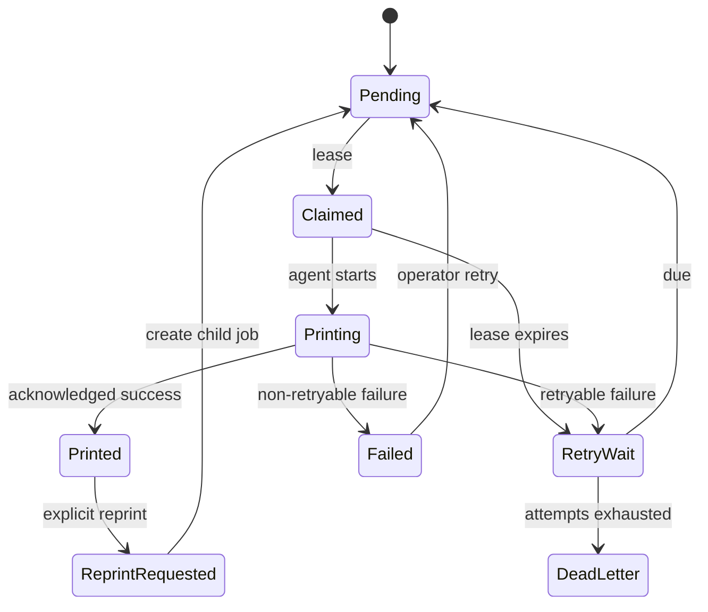
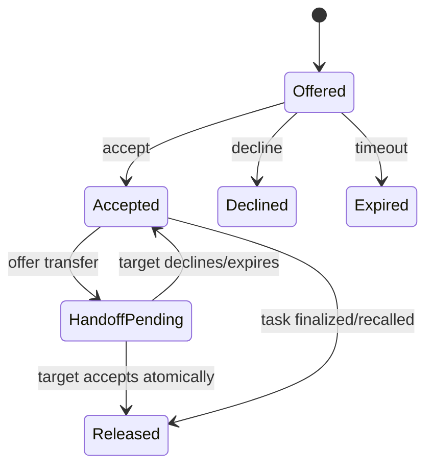

# Target state machines

These are Mazetto target models, informed by MeaSoft's separate courier report, office acceptance, money, warehouse and tracking domains. They are recommendations, not claims that MeaSoft uses these exact enum names. Source basis: [Статусная модель](https://wiki.courierexe.ru/index.php/Статусная_модель), [Выдача корреспонденции курьерам](https://wiki.courierexe.ru/index.php/Выдача_корреспонденции_курьерам), [Мобильное приложение курьера для Android](https://wiki.courierexe.ru/index.php/Мобильное_приложение_курьера_для_Android).

## 1. Order

| From | Action | To | Actor | Preconditions | Side effect |
| --- | --- | --- | --- | --- | --- |
| Draft | place | Placed | Cashier/customer | valid items, branch open, idempotency | totals snapshot, `OrderPlaced` |
| Placed | accept | Accepted | Cashier/system | payment policy passes | accepted revision, ticket intent |
| Placed | reject | Rejected | Cashier/system | configured reason | void auth, notify |
| Accepted | begin fulfillment | Fulfilling | System | ticket transaction created | kitchen/print events |
| Fulfilling | fulfill | Fulfilled | System | all required tickets handed off | delivery/pickup readiness |
| Fulfilled | complete | Completed | System/manager | delivery/pickup final and payment policy satisfied | final event/report |
| Active | cancel | Cancelled | Permissioned actor | state-specific cancellation policy | release/void/refund/stop tasks |

## 2. Kitchen

| From | Action | To | Actor | Preconditions | Side effect |
| --- | --- | --- | --- | --- | --- |
| Queued | accept | Accepted | Kitchen | station/branch match | timer and assignee |
| Accepted | start | Preparing | Kitchen | current version | prep metric |
| Preparing | ready | Ready | Kitchen | required items complete | ready notification |
| Ready | pack | Packed | Kitchen | packaging required | package/custody record |
| Ready/Packed | hand off | HandedOff | Kitchen + receiver | receiver identified | custody event |
| Queued/Accepted | cancel | Cancelled | Manager/system | cancellation policy | print/update kitchen |

Supplemental items create a new ticket/revision. Existing `Ready` ticket cannot regress to `Preparing` because a later item was added.

## 3. Delivery

| From | Action | To | Actor | Preconditions | Side effect |
| --- | --- | --- | --- | --- | --- |
| Unassigned | assign | Assigned | Dispatcher | active shift; no active assignment | offer notification |
| Assigned | accept | Accepted | Assigned courier | offer not expired | assignment accepted |
| Accepted | pick up | PickedUp | Courier/kitchen | item handoff verified | custody changes |
| PickedUp | depart | EnRoute | Courier | delivery data downloaded | customer ETA |
| EnRoute | arrive | Arrived | Courier | optional geo policy | wait timer |
| Arrived | report result | Reported* | Courier | reason/evidence/quantity validation | preliminary result, manager task |
| ReportedDelivered | finalize | FinalDelivered | Manager/cashier | docs and cash checked | customer final, settlement link |
| ReportedPartial | verify partial | FinalPartial | Manager | returned qty scanned | refund/inventory/cash recalc |
| ReportedFailed | reschedule | Rescheduled | Dispatcher | reason permits retry and slot valid | new attempt |
| ReportedFailed | return | Returning | Dispatcher/manager | custody still courier | return task |

## 4. Payment

| From | Action | To | Actor | Preconditions | Side effect |
| --- | --- | --- | --- | --- | --- |
| Unpaid | initiate | Pending | POS/customer | amount/method valid | provider operation |
| Pending | authorize | Authorized | Provider callback | signature and operation dedupe | ledger entry |
| Authorized | capture | Captured | System/provider | capture policy | receipt/revenue |
| Pending | fail | Failed | Provider/system | classified error | retry UX |
| Authorized | void | Voided | System/cashier | not captured | release authorization |
| Captured | refund | Partial/Refunded | Permissioned cashier/admin | refundable balance | refund transaction |

## 5. Print

| From | Action | To | Actor | Preconditions | Side effect |
| --- | --- | --- | --- | --- | --- |
| Pending | claim | Claimed | Print agent | matching route; atomic available lease | attempt opened |
| Claimed | start | Printing | Lease owner | token valid | diagnostic timestamp |
| Printing | ack success | Printed | Lease owner | stable agent attempt ID | final evidence |
| Claimed/Printing | fail | RetryWait/Failed | Agent/system | error classified | backoff/task |
| RetryWait | release due | Pending | Scheduler | nextAttemptAt reached | claimable again |
| RetryWait | exhaust | DeadLetter | Scheduler | max attempts | urgent task |
| Printed/Failed | reprint | ReprintRequested | Manager/support | reason + permission | child job and audit |

## 6. Courier assignment and handoff

| From | Action | To | Actor | Preconditions | Side effect |
| --- | --- | --- | --- | --- | --- |
| none | offer | Offered | Dispatcher/system | courier available | push/in-app notification |
| Offered | accept | Accepted | Target courier | not expired; task free | unique active owner |
| Offered | decline | Declined | Target courier | reason if required | dispatcher sees unassigned |
| Accepted | offer transfer | HandoffPending | Courier/dispatcher | current custody | handoff record |
| HandoffPending | accept transfer | Released + new Accepted | Target courier | both assignments/version valid | atomic custody event |
| Accepted | release | Released | System/dispatcher | finalized or recalled | history preserved |

## Concurrency and recovery

- Every command includes expected aggregate version; stale transition returns `409` with current state.
- Assignment accept, print claim, item quantity update and cash reconciliation use transaction/row lock plus unique constraints.
- Retried command with same idempotency key returns original result.
- Failed cross-domain effect retries from outbox; no state rollback by deleting events.
- Operator recovery is another permissioned action with reason, never direct database status editing.
