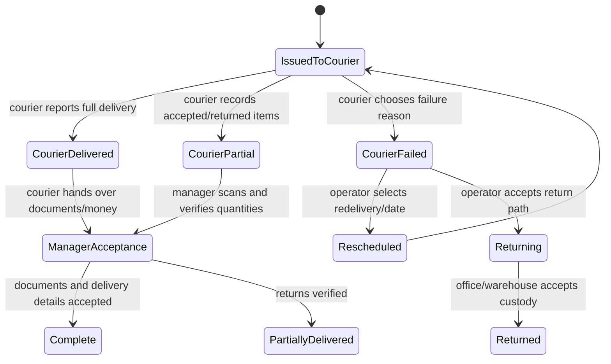

# MeaSoft status model and Mazetto mapping

## Evidence boundary

- **MEASOFT FACT:** MeaSoft bitta universal statusdan foydalanmaydi. Correspondence/user statusi, urgent-order system statusi, client statusi, manifest statusi, courier-reported result, office issue/acceptance result va tracking statuslari alohida ma'noga ega. Source: [Статусная модель](https://wiki.courierexe.ru/index.php/Статусная_модель).
- **MEASOFT FACT:** Kuryer mobil ilovada dastlabki natijani bildirishi mumkin; ofis menejeri hujjat, qaytgan tovar va pulni qabul qilib yakuniy delivery ma'lumotini saqlaydi. Source: [Выдача корреспонденции курьерам](https://wiki.courierexe.ru/index.php/Выдача_корреспонденции_курьерам).
- **OUR INTERPRETATION:** Bu separation of duty, chain of custody va moliyaviy reconciliation'ni bitta `order_status`ga aralashtirmaslik uchun ishlatilgan.

## MeaSoft status domains

| Domain | Kim o'zgartiradi | Vazifasi | Finality |
| --- | --- | --- | --- |
| Correspondence/user status | Operator/manager yoki integration | Mijozga mos operatsion tasnif | Konfiguratsiyaga bog'liq |
| Urgent order/system status | System va dispatcher | Tezkor topshiriq lifecycle'i | Ba'zilari final |
| Client status | Client/integration mapping | Mijoz tizimidagi holat bilan bog'lash | External view |
| Courier report | Courier mobile app | Yetkazish natijasini dastlabki bildirish | Preliminary |
| Issue/acceptance result | Office manager | Kuryerdan hujjat, qaytgan tovar va pulni qabul qilish | Operational final |
| Manifest status | Warehouse/linehaul staff | Manifest assembly, customs, departure, receipt | Alohida lifecycle |
| Tracking status | System/API | External tracking uchun normallashtirilgan code | Mixed |
| Payment/money document state | Cashier/accountant/manager | Pul kimda va hisob-kitob yopildimi | Financial finality |

## Tracking codes

Quyidagi jadval rasmiy status-model sahifasidagi code va triggerlarning qisqa parafrazidir.

| Code | Meaning / trigger | Type |
| --- | --- | --- |
| `AWAITING_SYNC` | Tashqi tizimdan sinxronlashni kutmoqda | System, non-final |
| `NEW` | Yangi jo'natma | Operational, non-final |
| `NEWPICKUP` | Yangi pickup | Operational, non-final |
| `PICKUP` | Pickup jarayonida | Operational, non-final |
| `WMSASSEMBLED` | Omborda yig'ildi | Warehouse, non-final |
| `WMSDISASSEMBLED` | Ombor komplekti ajratildi | Warehouse exception |
| `ACCEPTED` | Qabul qilindi | Custody, non-final |
| `CUSTOMSPROCESS` | Bojxona jarayonida | Linehaul, non-final |
| `CUSTOMSFINISHED` | Bojxona tugadi | Linehaul, non-final |
| `CONFIRM` | Kelishildi/tasdiqlandi | Operational |
| `UNCONFIRM` | Kelishuv bekor qilindi | Operational |
| `DEPARTURING` | Jo'nashga tayyorlanmoqda | Manifest |
| `DEPARTURE` | Jo'natildi | Manifest |
| `INVENTORY` | Inventarizatsiyada | Warehouse |
| `PICKUPREADY` | Olib ketishga tayyor | Pickup |
| `DELIVERY` | Yetkazishga chiqarildi | Delivery, non-final |
| `COURIERDELIVERED` | Kuryer “yetkazildi” deb bildirdi | Preliminary |
| `COURIERPARTIALLY` | Kuryer qisman yetkazishni bildirdi | Preliminary |
| `COURIERCANCELED` | Kuryer yetkazilmaganini bildirdi | Preliminary |
| `COURIERRETURN` | Kuryer qaytarishni bildirdi; operator redelivery yoki final non-delivery tanlaydi | Intermediate |
| `DATECHANGE` | Yetkazish sanasi ko'chirildi | Operational |
| `COMPLETE` | Yakuniy yetkazildi; sana va vaqt belgilangan | Final delivery |
| `PARTIALLY` | Yakuniy qisman yetkazildi; qaytgan enclosures saqlanadi | Final delivery |
| `CANCELED` | Yakuniy yetkazilmadi; sabab va sana saqlanadi | Final delivery |
| `RETURNING` | Qaytarish jarayonida | Return, non-final |
| `RETURNED` | To'liq qaytarildi | Return final |
| `LOST` | Yo'qotilgan | Exception final |
| `PARTLYRETURNING` | Qisman qaytarilmoqda | Return, non-final |
| `PARTLYRETURNED` | Qisman qaytarildi | Return final |
| `TRANSACCEPTED` | Transfer custody qabul qilindi | Transfer |
| `PICKUPTRANS` | Pickup transferda | Transfer |
| `STORETAKE` | Ombor custody'siga olindi | Warehouse |

## MeaSoft delivery finalization

**MEASOFT FACT:** Optional `Принято` bosqichi custody'ni kuryerdan menejerga o'tkazadi, yakuniy status keyin qo'yilishi mumkin. Qisman delivery qaytgan SKU va quantity bo'yicha skaner/tasdiq talab qiladi; to'liq tasdiqlanmagan forma majburan yopilsa o'zgarishlar saqlanmaydi. Source: [Выдача корреспонденции курьерам](https://wiki.courierexe.ru/index.php/Выдача_корреспонденции_курьерам).

## Recommended Mazetto status domains

| Domain | Proposed enum | Owner |
| --- | --- | --- |
| `OrderState` | `DRAFT`, `PLACED`, `ACCEPTED`, `FULFILLING`, `FULFILLED`, `COMPLETED`, `CANCELLED` | Order service |
| `KitchenState` | `QUEUED`, `ACCEPTED`, `PREPARING`, `READY`, `PACKED`, `HANDED_OFF`, `CANCELLED` | Kitchen service |
| `DeliveryState` | `UNASSIGNED`, `ASSIGNED`, `ACCEPTED`, `PICKED_UP`, `EN_ROUTE`, `ARRIVED`, `REPORTED_DELIVERED`, `REPORTED_FAILED`, `RETURNING`, `FINAL_DELIVERED`, `FINAL_FAILED`, `RETURNED` | Delivery service |
| `PaymentState` | `UNPAID`, `PENDING`, `AUTHORIZED`, `CAPTURED`, `PARTIALLY_REFUNDED`, `REFUNDED`, `FAILED`, `DISPUTED` | Payment service |
| `PrintState` | `NOT_REQUIRED`, `PENDING`, `CLAIMED`, `PRINTING`, `PRINTED`, `RETRY_WAIT`, `FAILED`, `DEAD_LETTER` | Print service |
| `SettlementState` | `NOT_APPLICABLE`, `OPEN`, `PARTIAL`, `SUBMITTED`, `VERIFIED`, `MISMATCH`, `CLOSED` | Cash/settlement service |

## Core invariants

1. `DeliveryState.REPORTED_DELIVERED` customer-facing “Yakun” emas; manager/cashier finalization actioni kerak.
2. `PaymentState.CAPTURED` delivery final bo'lganini anglatmaydi, delivery final bo'lishi ham cash reconciled degani emas.
3. Kitchen faqat kitchen actionlarini bajaradi; refund, delivery finalization va settlement vakolati yo'q.
4. Arbitrary status dropdown o'rniga `accept`, `startPreparation`, `reportDelivered`, `finalizeDelivery`, `reconcileCash` kabi command ishlatiladi.
5. Har transition current version/status precondition, actor permission va branch/tenant scope bilan tekshiriladi.
6. Har muvaffaqiyatli transition immutable event va outbox event yaratadi.
7. Cancellation/delete dependency-aware; moliyaviy yoki custody history bor yozuv fizik o'chirilmaydi.

## Source notes

- [Статусная модель](https://wiki.courierexe.ru/index.php/Статусная_модель), revision 2025-07-21.
- [Статусы](https://wiki.courierexe.ru/index.php/Статусы), revision 2022-11-21.
- [Выдача корреспонденции курьерам](https://wiki.courierexe.ru/index.php/Выдача_корреспонденции_курьерам), revision 2026-03-25.
- [Мобильное приложение курьера для Android](https://wiki.courierexe.ru/index.php/Мобильное_приложение_курьера_для_Android), revision 2026-07-24.
- [Манифесты](https://wiki.courierexe.ru/index.php/Манифесты).
